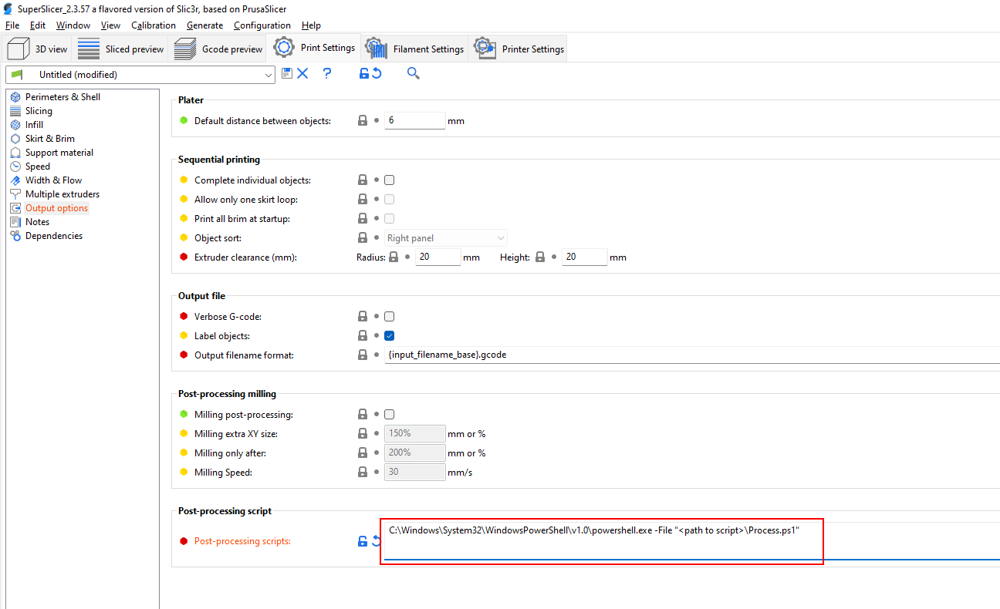

# Post processor

This is a post processor for SuperSlicer / PrusaSlicer that adds a command in top of the GCode that sets the boundry for the object thats beeing printed

```
Like this: SET_OBJECT_BOUNDRY X_MIN=<x min> X_MAX=<x max> Y_MIN=<y min> Y_MAX=<y max>
```

Then you can create a GCode Macro thats called SET_OBJECT_BOUNDRY that uses the variables to calculate other stuff

## Setup in Slicer

The post processor is installed in ***Print Settings / Output Options / Post-Processing scripts***

Remember to modify the path to the script



Example Video on YouTube
https://youtu.be/D8nQydqAAsM 

## Script

The post processer is downloadable as [Process.ps1](Process.ps1) in the repository

```PowerShell
[CmdletBinding()]
param (
    [Parameter(Mandatory, Position = 0)]
    [string]
    $GCodeFile
)

if (Test-Path $GCodeFile) {
    $Content = Get-Content $GCodeFile
}
else {
    Throw("$GCodeFile not found!")
}

if ($Content[0] -ilike "*SuperSlicer*") {
    $Slicer = "SuperSlicer"
}
elseif ($Content[0] -ilike "*PrusaSlicer*") {
    $Slicer = "PrusaSlicer"
}
else {
    Throw("Slicer not supported!")
}

Write-Host "Job created with $Slicer"

$Length = $Content.Length
$StartPrintAt = 0

# Detect Slicer
for ($i = 0; $i -lt $Length; $i++) {
    $_match = $null
    switch ($Slicer) {
        "SuperSlicer" {
            if ($Content[$i].StartsWith('; printing object')) {
                $_match = $i
            }
        }
        "PrusaSlicer" {
            if ($Content[$i].StartsWith(';TYPE:Perimeter')) {
                $_match = $i
            }
        }
        Default {}
    }
    if ($_match) {
        $StartPrintAt = $i
        break
    }
}

Write-Host "File Lenght: $Length"
Write-Host "Start print at: $StartPrintAt"

# Detect X Values
$x_matches = $Content | Select-String -Pattern "X(\d+\.\d+)" -AllMatches | ForEach-Object { [decimal]$_.Matches.Groups[1].Value } | Sort-Object
$x_min = $x_matches[0]
$x_max = $x_matches[$x_matches.Length - 1]

# Detect Y Values
$y_matches = $Content | Select-String -Pattern "Y(\d+\.\d+)" -AllMatches | ForEach-Object { [decimal]$_.Matches.Groups[1].Value } | Sort-Object
$y_min = $y_matches[0]
$y_max = $y_matches[$y_matches.Length - 1]

Write-Host "Boundery`nX: $x_min,$x_max `nY: $y_min,$y_max"
$x_parkPoint = (($x_max - $x_min) / 2) + $x_min
$y_parkPoint = $y_max + 5

# Write back to file
Write-Host "ParkPoint X$x_parkPoint Y$y_parkPoint"
$newContent = @($Content[0], "", "; Insert Boundry of object", "SET_OBJECT_BOUNDRY X_MIN=$x_min X_MAX=$x_max Y_MIN=$y_min Y_MAX=$y_max", $Content[1..($Content.Length - 1)])
$newContent | Set-Content -Path $GCodeFile
```